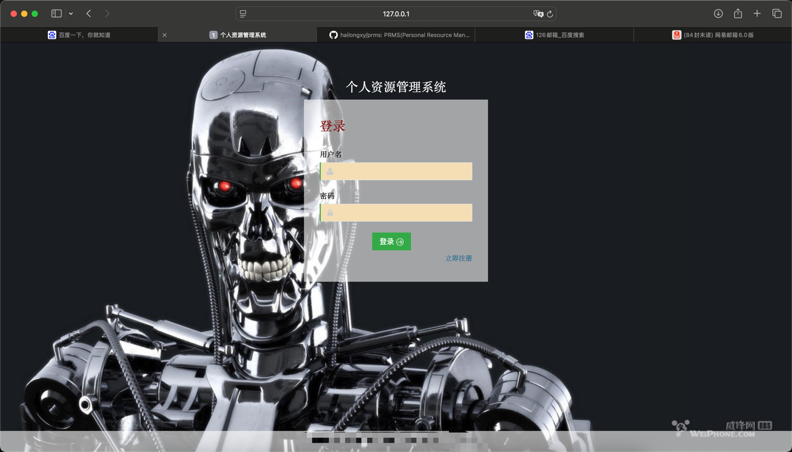
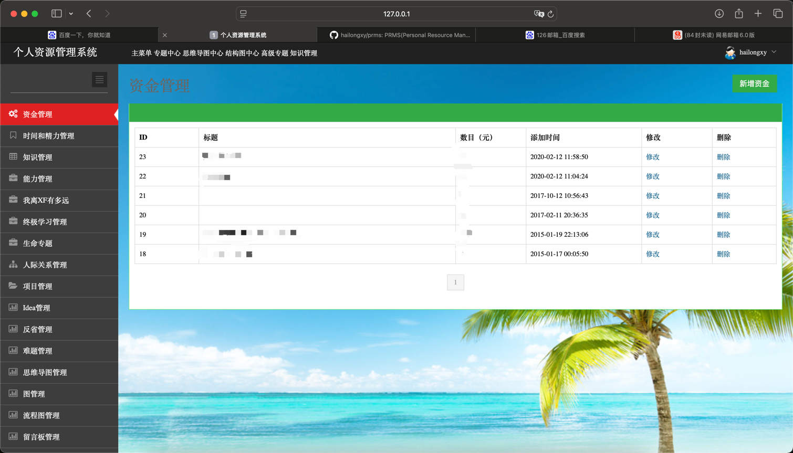
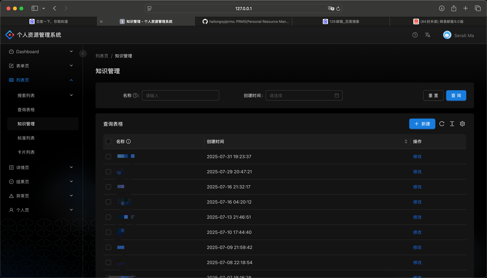
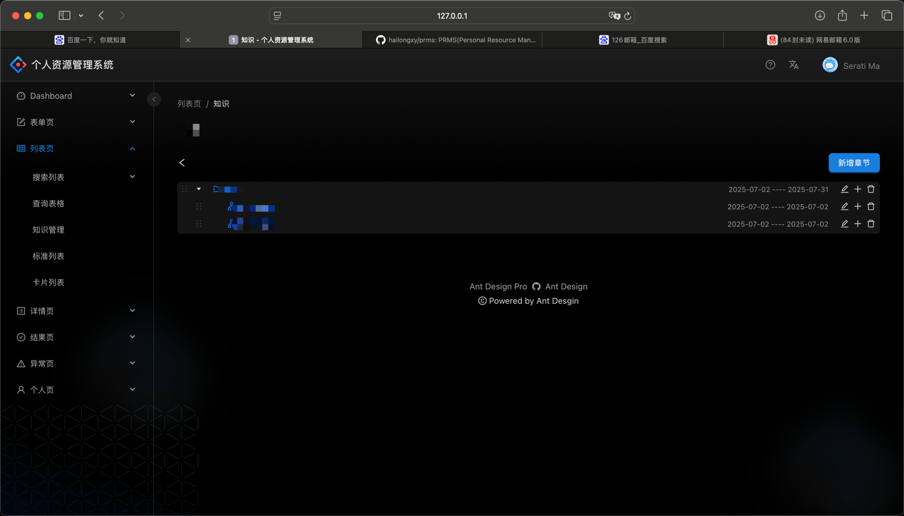
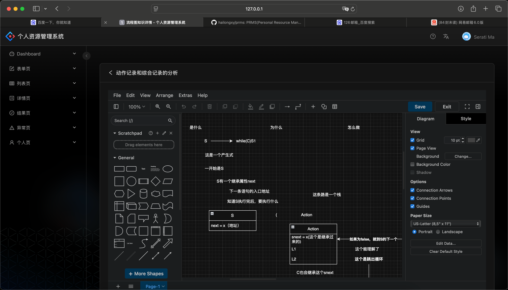
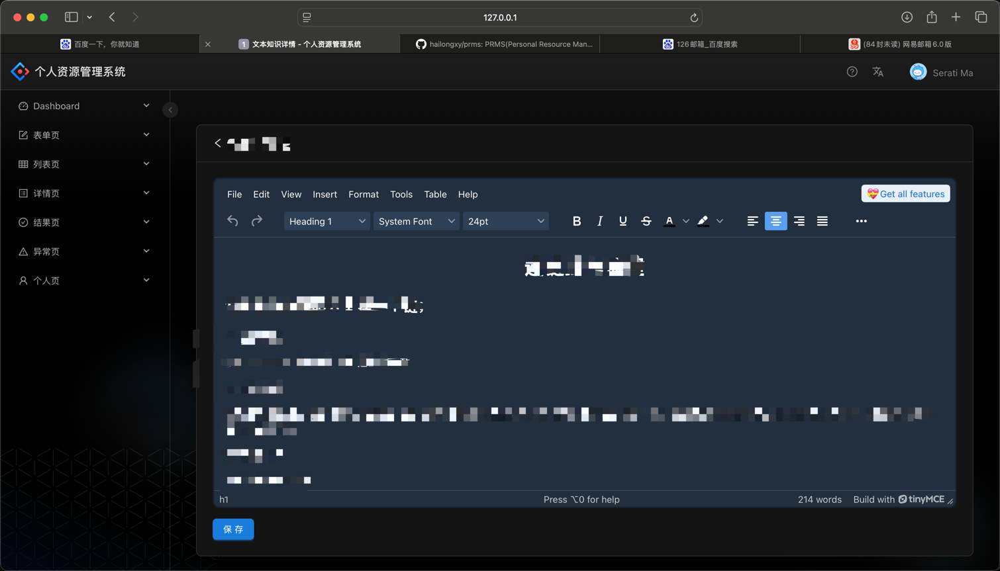
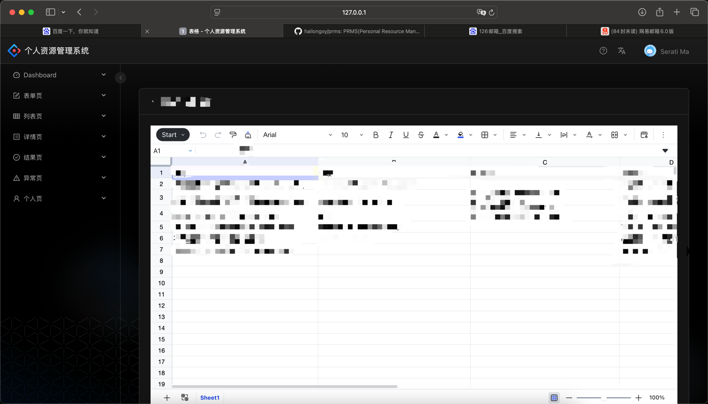
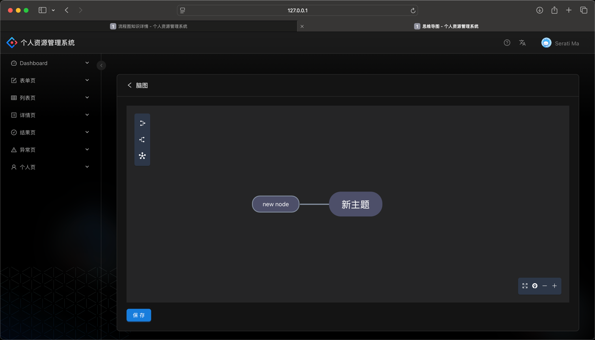

## PRMS(Personal Resource Manage System)

A system to manage your resource.developed by Go/PHP/React/Docker/K8s.

It will be a better assistant for you.

This is the UI:

Login page:

Home page:

Knowledge manage page:

Knowledge tree page:

Flow map page:

Doc page:

Table page:

Mind map page:
